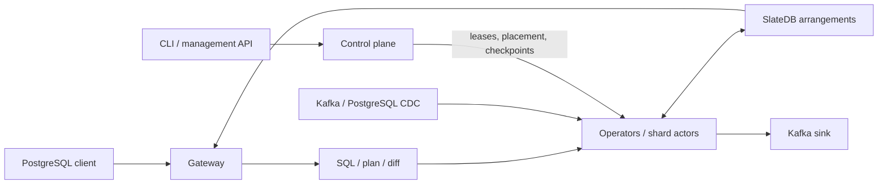

# RockStream Architecture

This document explains how RockStream is built and how it works. It is written
to be read from top to bottom: it starts with the core idea, follows a single
piece of data on its journey through the system, and then opens up each major
subsystem in turn. If the [README](README.md) tells you *what* RockStream does
and *why*, this document tells you *how*. It describes the **v0.71.0** workspace
and the current implementation. The deeper specifications —
[DESIGN.md](DESIGN.md) for the full system and [IVM.md](IVM.md) for the
incremental engine — provide design detail, including planned behavior. For
public support commitments, use the [capability matrix](docs/capability-matrix.md)
and [SQL support reference](docs/reference/sql-support.md). An operator or
protocol implemented in Rust does not by itself imply SQL reachability.

---

## 1. The One Idea Everything Hangs On

Almost every interesting property of RockStream falls out of a single
commitment: **never recompute an answer from scratch when you can compute only
what changed.** A traditional database, asked for "total sales per region,"
re-scans every order, re-groups it, and re-sums it on every query. RockStream
instead keeps the answer materialized and, when a handful of new orders arrive,
works out the *difference* those orders make to the existing answer and applies
just that difference. The scoreboard stays lit; only the numbers that moved tick
over.

This technique is called **Incremental View Maintenance** (IVM), and the precise
mathematical form RockStream uses comes from a body of work called **DBSP** — the
theory behind DBSP and, in spirit, the differential
dataflow theory that underlies other streaming systems. The reason
RockStream leans so hard on a *theory* rather than a bag of hand-written rules is
that incremental computation is treacherous. It is easy to write an
update-the-total shortcut that is correct for inserts but subtly wrong for
deletes, or for an outer join, or when a late record arrives out of order. DBSP
provides the equivalence that the implementation aims to preserve:

> For a supported query `Q`, incremental maintenance over changes `Δ` produces
> the same weighted result as batch evaluation over the accumulated data.

Exact integer and decimal aggregates, integer-key equi-joins, and supported time
windows are Core capabilities. Floating-point aggregation is approximate and
Experimental; text aggregates and binary UTF-8 equi-joins are Maintain.
Equivalence of query results does not imply identical row ordering or wire bytes.

RockStream does not merely hope this holds — it *tests* it continuously, with a
dedicated correctness oracle described in §9. Everything else in the
architecture exists to make this idea fast, durable, distributed, and reachable
through tools you already own.

### Changes as numbers: the Z-set

To make "the difference a change makes" something a computer can add and
subtract cleanly, RockStream represents data not as rows but as **Z-sets**. A
Z-set is a collection of rows where each row carries an integer **weight**. A
weight of `+1` means "this row was inserted"; `-1` means "this row was deleted";
an update is simply a `-1` for the old version paired with a `+1` for the new
one. Aggregates, joins, and filters all become arithmetic over these weights,
and — crucially — the operations are associative and commutative, so changes can
be reordered, batched, and merged without changing the final answer. In the
code, `ArrowZSet` pairs an Arrow `RecordBatch` with integer weights; helpers also
encode weights as a column for transport. This means
the engine gets columnar, vectorized data layout for free. This single
representation is what lets the same delta flow correctly whether it is processed
now or replayed after a crash, on one machine or shuffled across thirty.

---

## 2. A Day in the Life of a Change

Before dissecting the parts, it helps to watch the whole machine move. Suppose
you have created a materialized view — `SELECT region, SUM(amount) FROM orders
GROUP BY region` — and a new order arrives.

1. **The change enters.** It arrives either through a **connector** (Kafka or a
   PostgreSQL CDC stream) or because a client issued a direct `INSERT`
   over the Postgres wire protocol into the **gateway**. Either way it becomes a
   `+1`-weighted row in a Z-set.

2. **It joins an epoch.** RockStream does not process one row at a time. It
   batches changes into a small unit called an **epoch** — think of it as a
   micro-transaction. The epoch is the atom of progress, recovery, and
   consistency; everything the system commits, it commits one whole epoch at a
   time.

3. **It flows through the circuit.** The view's query was compiled, once, into a
   graph of **operators** — a "circuit." Our order's delta enters at the source
   node and flows downward. The `Filter` and `Project` operators apply their
   predicate or expressions to the delta (they are *linear*); the `Aggregate`
   operator reads the current `SUM` for that region from its arrangement,
   adds the delta, and emits the *change to the output* — say, region "EMEA"
   went from 4,200 to 4,350, so it emits `-1×(EMEA,4200)` and `+1×(EMEA,4350)`.
   Distributed ingestion assigns rows by routing key to shard owners, so equal
   grouping or join keys reach the same partition.

4. **State is persisted.** The aggregate's running total lives in an
   **arrangement** — an indexed, persistent key-value structure backed by
   SlateDB on a local-filesystem or shared object-store backend. The new total
   is written as part of the epoch's atomic **WriteBatch**.

5. **The epoch commits.** Once every operator in the circuit has processed the
   epoch and all writes are durable, the shard advances its **frontier** — a
   marker meaning "every change up to here is committed and queryable." In a
   multi-shard cluster, the **control plane** waits until *all* shards reach the
   epoch before declaring the cluster-wide frontier has advanced.

6. **The answer is served.** A moment later you run `SELECT * FROM
   sales_by_region` through `psql`. The gateway reads the materialized view
   straight from the arrangement — no scanning of raw orders, no re-summing — and
   hands back the fresh number. If you need read-your-writes certainty, you can
   ask it to wait until the frontier covering your write is visible.

That entire loop — change in, delta computed, state updated, epoch committed,
answer served — is the heartbeat of RockStream. The rest of this document is the
anatomy behind that heartbeat.

---

## 3. The Shape of the System: Crates and Layers

The Cargo workspace contains **seventeen crates under `crates/`**, plus the
`fuzz` package. `rockstream-cli` builds the operator binary, `rockstream`;
`rockstream-docgen` builds the reference generator. These are responsibility
boundaries rather than a strict dependency ladder: for example, SQL depends on
control and storage, and the gateway composes compilation, runtime, and connectors.

| Responsibility | Crates | Main contract |
| --- | --- | --- |
| Shared vocabulary and verified kernels | `rockstream-types`, `rockstream-verified` | Epochs, weighted batches, identities, schemas, checked arithmetic, codecs, routing and frontier kernels |
| Compilation | `rockstream-sql`, `rockstream-plan`, `rockstream-diff` | SQL → logical `PlanNode` → physical `OpNode` circuit |
| Execution and persistence | `rockstream-ops`, `rockstream-runtime`, `rockstream-storage` | Operators, shard actors, exchange, arrangements and durable epoch commits |
| Coordination and administration | `rockstream-control`, `rockstream-management-proto` | Leases, placement, checkpoints, migrations and versioned management RPCs |
| User and I/O boundaries | `rockstream-gateway`, `rockstream-connectors`, `rockstream-cli` | PostgreSQL protocol, Kafka/CDC, configuration and node lifecycle |
| Validation and references | `rockstream-oracle`, `rockstream-sim`, `rockstream-test-support`, `rockstream-docgen` | Batch comparison, seeded faults, external-service harnesses and generated docs |

The following diagram shows the main execution flow, not Cargo dependencies:

**rockstream-types** is the shared vocabulary of
the system: epochs and event-time watermarks, frontiers, Z-set batches, schema
definitions and their evolution rules, identity types for workers and operators,
the merge-law descriptors that underpin algebraic aggregation, ACLs, checkpoint
coordination types, the view lifecycle state machine, and the error codes that
appear in operator diagnostics. Because every other crate speaks in these terms,
a frontier means exactly one thing whether it is being computed in an operator,
shuffled across the network, or reported up to the control plane.

It depends on **rockstream-verified**, whose Verus kernels are used by production
callers for selected arithmetic, encoding, routing, persistence and frontier
checks. This verification covers those kernels under their stated assumptions;
it is not a proof of the entire database. The sections that follow walk the
system in the order a query travels through it.

---

## 4. From SQL to a Circuit: The Compilation Front-End

When you write `CREATE MATERIALIZED VIEW sales AS SELECT ...`, three crates
collaborate to turn that text into a running incremental circuit, and they do so
at view creation or reconstruction after recovery, rather than on every change.

**rockstream-sql** is the front door. Rather than reinvent SQL parsing and
optimization, it stands on the shoulders of [Apache
DataFusion](https://datafusion.apache.org/): it parses your statement, binds it
against the schema catalog, and runs DataFusion's optimizer to produce a clean
logical plan. It then *lowers* that plan into RockStream's own intermediate
representation. Along the way it recognizes which operations must be
incrementally maintained and marks them with custom extension nodes
(`IncAggregate`, `IncJoin`, `IncDistinct`), runs a **distribution pass** that
annotates each operator with the key it should be partitioned on and inserts
`Exchange` markers where data must be shuffled between shards, and consults a
versioned **schema catalog** so it can tell a backward-compatible change from a
breaking one. This crate is also where the operator-facing diagnostics
`EXPLAIN INCREMENTAL` (the annotated operator tree) and `EXPLAIN INCREMENTAL
ESTIMATE` (a static cost-and-state-size preview you can run *before* deploying)
are produced.

**rockstream-plan** holds the two intermediate representations that everything
downstream agrees on. The `PlanNode` enum is the *logical* IR — declarative
nodes like `Source`, `Filter`, `Project`, `Aggregate`, `Join`, `Union`,
`Distinct` — and the `OpNode` graph is the *physical* IR, the concrete operator
graph that will actually execute. Keeping this contract in its own tiny crate
means the SQL front-end and the execution engine can evolve independently as long
as they keep speaking `PlanNode` and `OpNode`.

**rockstream-diff** is the mathematical heart of compilation, and it earns its
name. Its single differentiation pass — the `∂` of DBSP — walks the logical
`PlanNode` tree and emits the physical `OpNode` circuit, applying the DBSP delta
rules as it goes. For *linear* operators like filter, project, and map, the
incremental rule is beautifully simple: the change to the output is just the
operator applied to the change in the input, so the delta rule is essentially the
identity. For *stateful* operators like aggregates, it is subtler: the pass wires
up the arrangement state and the read-modify-emit logic that turns a delta on the
input into a delta on the running result. This is precisely the place where
incremental correctness is won or lost, which is why it is small, focused, and
guarded by the oracle.

`rockstream-ops::compile` constructs executable operators from the physical
graph. The gateway uses this compiled path for maintained views and dispatches
committed deltas through view dependencies. Inline views expand at compilation
time without owning separate maintenance state. Compatible consumers can share
indexed arrangements tracked by `ArrangementCatalog`.

The Rust IR includes more nodes than the public frontend admits. Unsupported
constructs must be rejected at the frontend or compilation boundary; see
[language features](docs/language-features.md) for the supported subset.

---

## 5. Running the Circuit: The Execution Engine

### 5.1 Operators (`rockstream-ops`)

If the front-end builds the circuit, **rockstream-ops** is the library of parts
the circuit is made from, plus the scheduler that drives them. Every node in the
graph implements a common `Operator` trait and runs inside an `OperatorTask`
event loop that consumes input deltas and produces output deltas. The crate
implements the operator catalog: the stateless linear operators (filter,
project, map); the stateful ones that maintain arrangements (aggregate with its
DBSP delta rules, min/max via indexed arrangements, distinct, top-K, time
windows, inner and outer joins); the source operators that introduce data; and
the `ViewSink` that writes finished results out.

Two pieces of machinery here are worth calling out because they shape the
system's behavior. The **credit scheduler** is how RockStream meters work: an
operator runs only when it has been granted credits, which lets the system pace
ingestion, apply backpressure, and hit freshness targets rather than simply
running flat-out and falling over. The **group-commit** mechanism coalesces many
small `WriteBatch`es into fewer, larger writes to storage, which matters
enormously when your durable store is object storage and every write has latency
and cost. The crate also ships an `EmbeddedRuntime` that runs a whole circuit in
a single process — the engine you get on a laptop, and the engine the tests
exercise. Public support varies by operator and input type; the capability
matrix, rather than the presence of an implementation, defines the commitment.

Stateful operators use spillable arrangements to keep a bounded working set in
memory and load colder keys from `ShardDb` on demand. Worker memory accounting,
the `SpillGovernor`, transport limits and source-pressure controls share the
task of keeping work bounded. Dirty state belongs to the durable epoch commit;
evicting a cache entry is not an acknowledgement of a committed change.

### 5.2 State and durability (`rockstream-storage`)

Operator state and view results all live in **arrangements**, and arrangements
live in **SlateDB** — an LSM-tree key-value store designed to sit directly on
object storage. The configured backend can be a local filesystem for a standalone
node or S3-compatible storage, including MinIO, for shared durable state. Shared
storage allows compute ownership to move without copying a shard's full dataset
between workers. Moving a local deployment to a different backend still requires
an explicit export/restore or data transfer.

**rockstream-storage** is the disciplined wrapper around SlateDB's real API
surface. It owns the **key encoding scheme** that namespaces every shard's data
so nothing collides; the `ShardDb` abstraction for per-shard reads and writes;
the `WriteBatch` builders that make an epoch's writes atomic; `ShardReader`,
which wraps SlateDB's `DbReader` for checkpoint-pinned reads; and a
**merge-operator registry** that
teaches SlateDB how to combine partial aggregates (a `SUM`, a `COUNT`) directly
in the store, so the engine can often avoid an expensive read-modify-write
round-trip entirely. It also manages the write-ahead log and a WAL-listing cache
that keeps the hot path from paying for expensive object-store `LIST` calls. A
deliberate constraint runs through this crate: it assumes only what SlateDB
actually offers (for example, there is no range-delete, so cleanup is done by
scan-and-delete or compaction filters), which keeps the design honest about its
real foundation. Optional local NVMe block caching and SSTable Bloom filters
reduce repeated object-store reads and negative arrangement lookups. The cache
is disposable; the configured durable backend remains authoritative.

Metadata has its own durable owner: `DurableCatalogStore` in
[`rockstream-storage::catalog`](crates/rockstream-storage/src/catalog/store.rs).
Catalog transactions persist versioned, checksummed records with stable object
IDs and a monotonic catalog revision. Recovery loads a valid snapshot and replays
later transaction logs. Snapshots include committed operation IDs, preserving
retry deduplication after restart and log compaction. Old logs are deleted only
after a durable snapshot has been validated. SQL and PostgreSQL catalog
projections are derived from this recovered state rather than independent
authoritative copies.

### 5.3 The worker and the exchange (`rockstream-runtime`)

**rockstream-runtime** is what a worker process actually *is*. It wraps the
operator scheduler with everything needed to participate in a cluster: a client
that registers the worker with the control plane, acquires and renews the
**leases** that grant it ownership of particular shards, and sends heartbeats. It
houses the **recovery driver** that brings a shard back from its last checkpoint,
and a **self-fencing** mechanism that forces a worker which has lost contact with
the control plane to stop committing, so it cannot race a newly-appointed owner
of the same shard.

`ShardActor` owns a shard's circuit and durable commit path. Source routing uses
key affinity: the control service hashes a declared routing column into virtual
buckets and maps buckets to shard owners with rendezvous hashing. Missing routing
columns fail rather than falling back to arbitrary placement. This keeps equal
keys together and makes each worker responsible for its own arrangement partition.

The **exchange** subsystem moves weighted Arrow batches between operators.
It supports bounded loopback channels, a same-host shared-memory path, direct
gRPC streams with Arrow IPC, and durable object-store shuffle. Path selection
depends on placement and topology. `DurableShuffleWriter` persists outbox data
before commit on the durable path; fast paths do not universally write a shuffle
WAL. Protocol negotiation, frame validation, lease checks, replay identities,
connection generations and flow-control permits protect the transport boundary.

There is also a separate public request path in
[`DataPlaneClient`](crates/rockstream-runtime/src/data_plane.rs): the gateway
sends deployment, source-delta and workload-metadata requests as JSON over TCP to the
control service. Its `route_source_delta` forwards row-bearing execution messages
to worker owners and waits for acknowledgements. The existence of direct gRPC
exchange therefore does not mean all gateway row traffic bypasses control.

---

## 6. Coordinating a Cluster: The Control Plane

A single worker can maintain views happily on its own, but RockStream is built to
scale horizontally, and **rockstream-control** is the brain that makes a fleet of
workers behave like one system. It uses shared types and verified kernels,
plan contracts, storage, simulation primitives and the management protocol.

It maintains the **topology catalog** of which workers exist and what they are
running; a **shard manager** that hands out shard leases protected by **fencing
tokens** (a monotonically increasing number that lets storage reject a write from
a stale, fenced owner); a **shard scheduler and placement algorithm** that
decides which worker should host which shard based on capacity; and a
**namespace catalog** that organizes views and shards. Two of its jobs are
especially central to correctness. The **frontier aggregator** collects each
worker's per-shard frontier reports and computes the cluster-wide frontier as
their *meet* (the minimum) — the single value that defines what epoch a query can
be answered consistently at. And the **checkpoint coordinator** drives the
protocol that coordinates durable progress and recovery, which
deserves its own section.

The control plane also keeps an **audit log** (file-backed JSONL) of every action
it takes — every scaling decision, every degraded-state transition, every
pipeline change, each stamped with the metric reading that triggered it. This is
a design principle, not a feature bolt-on: nothing changes silently, and
`rockstream audit tail` exposes the recorded decisions.

The control crate also contains persistent topology and lease stores, Raft
leader-election machinery, secret storage and migration coordination. Migration
progress is durable: donor drain, checkpoint transfer, lease handoff and recipient
open acknowledgements determine which phase can safely resume after restart.

The versioned gRPC management contract lives in **rockstream-management-proto**.
The control service exposes node and shard inspection plus drain, migration and
backup operations. Mutations bind an idempotency key to a request digest and a
durable operation record; pagination, concurrency and acknowledgement waiters
have explicit bounds. Endpoint capabilities depend on attached executors and
storage. This endpoint currently has no TLS or server-side role check; deploy it
on a trusted network. Its health telemetry is separate from the HTTP node-health
endpoint described in §10. See the
[management API reference](docs/reference/management-api.md).

### The checkpoint protocol, briefly

Exactly-once processing in a distributed system is hard precisely because crashes
can happen between any two steps. RockStream's answer is a barrier-based
checkpoint protocol. The coordinator starts a round and injects a
**checkpoint barrier** for every participating shard. Operators propagate and
acknowledge barriers; a bounded **alignment buffer** holds data during alignment.
The coordinator validates per-shard confirmations against the active checkpoint
ID and commits the cluster manifest only when all participants have confirmed.
Retained checkpoints are garbage-collected according to the retention horizon.
On top of
this foundation, the Kafka sink layers a **two-phase commit** (prepare, then
commit after checkpoint success or abort on failure). Source offsets and sink
recovery state must agree with the committed checkpoint; guarantees depend on
the connector and its configuration, as detailed in §8.

`RecoveryDriver` reconstructs committed shard state before readiness. Checkpoint
exports pin the data and metadata needed for restore; malformed manifests,
missing payloads, incompatible formats and checksum failures must fail closed.
Standalone restart, backup and restore are separate from cluster reassignment.
Historical targets of 5 seconds for detection, 30 seconds for reassignment and
60 seconds for freshness recovery describe particular scenarios, not universal
restore times. Current recovery paths enforce their own configured budgets and
report progress and RS-coded failures. Use the
[disaster-recovery runbook](docs/disaster-recovery.md) and
[measured chaos baseline](docs/chaos-recovery-baseline.json) for procedures and
evidence.

---

## 7. The Front Door: The Postgres Gateway

The decision that makes RockStream immediately usable is that it speaks the
**Postgres wire protocol**. **rockstream-gateway** implements that protocol via
`pgwire`, which means `psql`, your BI tool, and any Postgres client library can
connect to RockStream as if it were a Postgres database — no special driver, no
new query language.

The gateway plays two roles. On the **read** side it serves OLAP queries against
maintained views: a `ViewReader` pulls results straight from the arrangements,
and for views spread across many shards a `MultiShardReader` performs a scatter
read pinned to a single frontier so the answer is internally consistent. On the
**write** side it accepts direct `INSERT`/`UPDATE`/`DELETE` DML, buffering it in a
bounded `WriteBuffer` and feeding it into the engine as a change stream — exactly
as if it had arrived from an external source. This is what lets you get data in
without standing up a separate database or a Kafka topic. To keep Postgres tools
happy, the gateway projects the durable catalog into supported `pg_catalog` and
`information_schema` relations. It also manages transaction/session state,
prepared statements, cursors and COPY, subject to the documented protocol subset.

Beyond plain queries it offers the features that make a streaming system pleasant
to use: a `SUBSCRIBE` handler that streams a view's changes to a client as CDC,
`AS OF EPOCH` historical queries, **freshness tokens** that let a client request
read-your-writes behavior by waiting for a specific frontier to become visible,
and authentication via OIDC or mTLS. Supported `rockstream_catalog` relations
expose source, sink, view, shard, checkpoint, workload and operation state.
Lineage and view-status diagnostics connect a stalled view to its upstream
sources and dependencies. PostgreSQL wire compatibility does not imply full
PostgreSQL SQL compatibility; unsupported constructs fail with actionable
RS-coded errors.

---

## 8. Getting Data In and Out: Connectors

**rockstream-connectors** is the system's I/O boundary. It defines two contracts
— a `SourceConnector` trait for bringing data in and a `SinkConnector` trait for
writing results out. The supported connector set is **Kafka source, PostgreSQL
CDC source and Kafka sink**, all Core capabilities in the current contract.

The interesting engineering here is all about exactly-once correctness across the
boundary. On the source side, a `SourceEpochRegistry` records exactly which input
partitions and offsets contributed to each epoch, with an `OffsetToken` that
allows recovery to resume from committed progress. Kafka tracks partition
offsets across rebalances, while PostgreSQL CDC coordinates snapshot-to-stream
handoff and transaction boundaries, including shared replication-slot consumers.
Replay can occur; durable identities and committed progress prevent it from
becoming duplicate visible output.

The Kafka sink prepares transactional output and commits it according to the
checkpoint protocol. Exactly-once visibility depends on the documented producer,
broker and consumer settings. The connector guarantee matrices exercise crash
boundaries, restart, replay, lag and bounded buffering, with external-service
tests where required. See [connectors](docs/connectors.md) for configuration and
the capability matrix for named proofs.

Iceberg, Delta, object-store sink, S3 source and webhook source frontends have
been removed and fail closed. Catalog compatibility records do not make them
active connectors. Lakehouse exports use the Kafka sink with a downstream writer;
see [connector migration](docs/connector-migration.md).

---

## 9. Why You Can Trust It: Oracle and Simulator

Correctness evidence combines batch comparison, simulation, verified kernels
and real-backend tests. Each checks a different boundary.

**rockstream-oracle** is the guardian of the central DBSP promise. Its job is to
relentlessly check that `incremental(query, Δ) == batch(query, accumulated)`. It
does this by accumulating Z-set deltas, running the *same* query as an ordinary
one-shot DataFusion batch computation as a reference answer, and comparing the
two. It drives this comparison with property tests over every operator — filter,
project, map, the aggregates (SUM/COUNT/AVG), min/max, distinct, top-K, time
windows, outer joins — and with a SQL fuzzer that throws generated queries at the
engine, plus TPC-H data generation for realistic shapes. If the incremental
engine disagrees with the reference in a gated test, that test fails. Exact
weighted comparisons apply to exact types; floating-point cases have their own
approximate contract.

**rockstream-sim** is the flight simulator, a technique borrowed from
[FoundationDB](https://www.foundationdb.org/). Simulated components use a
`Runtime` abstraction for time, task spawning, storage and network I/O, with
Tokio and `SimRuntime` implementations. The simulated clock, network and object
store are deterministic and driven by a seeded random-number generator. Inside
that simulated world, a `buggify!` macro injects faults at the nastiest
moments — network partitions, replica failures, object-store brownouts, messages
reordered and duplicated, two workers crashing milliseconds apart. Because
the simulated execution is deterministic, failures can be reproduced from a seed
and retained as regression cases. Production paths also contain direct Tokio and
external-service I/O; simulation does not replace exercising those paths.

**rockstream-test-support** supplies reusable external harnesses, MinIO setup
and test PKI. Local-filesystem, MinIO, Kafka, PostgreSQL and multi-process tests
cover storage and protocol behavior outside the simulated world.
**rockstream-verified** supplies the smaller formally checked kernels described
in §3. Fuzz targets exercise malformed inputs and parser boundaries.

The [evidence manifest](docs/evidence-manifest.json), capability proof inventory
and [version sign-offs](sign-offs/) identify what was checked for each candidate.
They are the evidence for a release claim; the presence of a simulator or a
verified kernel alone does not establish an end-to-end guarantee.

---

## 10. One Binary, Three Tiers: Deployment

All of this is delivered as a single executable. **rockstream-cli** builds the
`rockstream` binary, and a node's *role* is a command-line flag rather than a
separate program. The same binary can be the whole system, a gateway, a worker,
or a control node; a frontier role is also available:

- **Laptop / single host:** `rockstream start --role all --storage ./data` runs
  the embedded system with a local durable backend.
- **Shared object storage:** keep `--storage` as the local node-artifact
  directory and configure the runtime object-store backend with the
  `ROCKSTREAM_OBJECT_STORE_*` environment contract. The backend builder requires
  an endpoint, bucket and credentials; it defaults the region to `us-east-1`.
  See [`build_runtime_object_store`](crates/rockstream-storage/src/tiered_store.rs).
- **Multi-host cluster:** start `--role control`, `--role worker` with
  `--control http://control:8000`, and gateway nodes as needed. Workers need
  access to the durable state for the shards they own.

`NodeConfig` supplies effective configuration to the role components;
`NodeRuntime` coordinates startup, recovery, readiness, drain and shutdown.
Configuration and backend choice are explicit. A local directory is
authoritative in a local deployment; shared storage makes lease movement easier,
but changing backends is an export/restore operation, not automatic scaling.
See [configuration](docs/configuration.md) and the generated
[configuration reference](docs/reference/configuration.md).

The HTTP metrics service exposes `/metrics`, `/live`, `/ready` and `/health`.
Readiness follows lifecycle/recovery state. The health report evaluates liveness,
readiness, availability, freshness, durability, capacity and degradation, with
provenance and staleness checks for observations.
These HTTP reports are distinct from gRPC management `GetHealth`, which remains
`unknown` without authoritative telemetry registered there.

Operator diagnostics include `rockstream doctor`, `view status`, `source status`,
`sink status`, `explain`, `resource usage`, `audit tail` and `support bundle`.
Bounded probes, catalog scans and lineage traversal prevent diagnosis from
becoming an unbounded workload. **rockstream-docgen** generates the checked-in
CLI, SQL, configuration, catalog, metric and error references from the public
contracts. See the [operator guide](docs/operator.md),
[CLI reference](docs/reference/cli.md) and [metrics](docs/metrics.md).

---

## 11. The Threads That Tie It Together

A few principles recur across every layer, and noticing them is the fastest way
to understand why the code looks the way it does.

**The epoch is the universal unit.** Ingestion batches into epochs, the circuit
processes epochs, storage commits epochs atomically, frontiers advance by epoch,
checkpoints align on epochs, and connectors track their offsets by epoch. Once
you see the epoch as the system's clock-tick, the coordination protocols stop
looking arbitrary.

**Algebra is the safety net.** Z-sets make changes addable and subtractable;
merge laws make aggregates combinable in storage and across a shuffle without
read-modify-write; and the DBSP differentiation pass is correct because the
algebra underneath it is. Where an operation *cannot* be expressed as a clean
algebraic law, the system records an explicit, machine-readable reason rather than
guessing — and `EXPLAIN INCREMENTAL` will show it to you.

**Compute and storage are separate tiers.** SlateDB-on-object-storage is the
hinge that lets shared-storage deployments move shard ownership independently
of durable data. Recovery uses committed state, checkpoints and the relevant
logs; its cost depends on the recovery path and the workload.

**Nothing changes silently, and nothing is promised that isn't tested.** The
audit log records control-plane decisions with their triggers; the oracle checks
incremental results against batch results; the simulator manufactures the rare
failures that would otherwise surface only in production. The recovery budgets,
connector guarantees, and the freshness SLOs require named evidence for a
specific candidate and scenario. Public scope is single-region; full PostgreSQL
compatibility, custom user merge laws and unrestricted SQL are outside the
current contract.

Read together, these threads explain the architecture's character: a small,
theory-grounded core wrapped in the operational machinery needed to run it at
scale, delivered through an interface deliberately chosen to be one you already
know.
