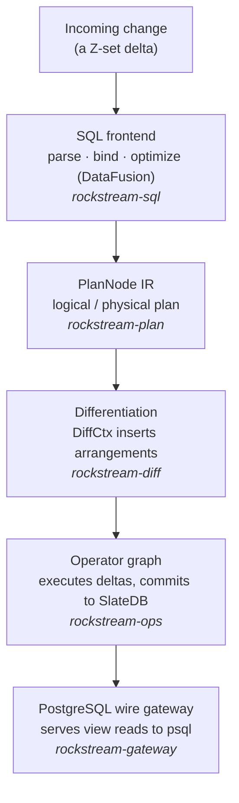
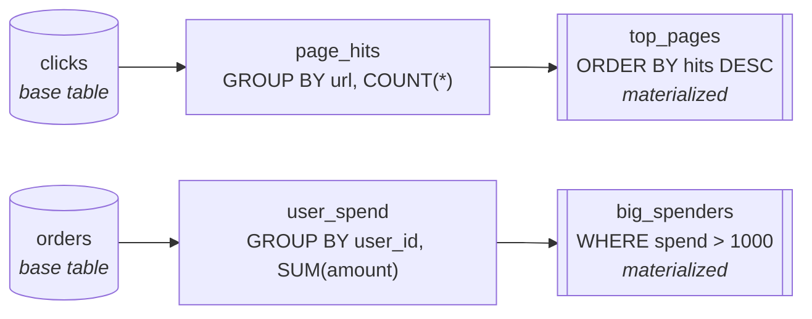
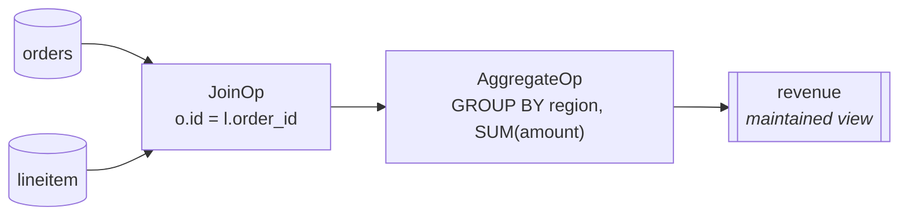

# RockStream in 30 Minutes: From Theory to a Live SQL Engine

Welcome. The next half hour takes you from *never having heard of incremental
view maintenance* to *running the RockStream engine on your own machine, talking
to it with `psql`, building a DAG of materialized views, and watching its
correctness proofs execute in front of you*.

This is a hands-on tutorial, and **every command in it really runs.** That
matters, because RockStream is a young project in the middle of an honest,
evidence-driven build-out. Rather than show you a glossy demo of features that
don't exist yet, this guide does two things:

1. **Explains the ideas** that make RockStream different — incremental view
   maintenance, Z-sets, frontiers, merge laws, and bottomless cloud state.
2. **Lets you reproduce reality.** You will build the workspace, boot a node that
   speaks the PostgreSQL wire protocol, connect a real `psql` client, assemble a
   dependency graph of views, watch the engine reject a cycle, and then run the
   project's own proofs that show the incremental engine producing
   *bit-identical* results to a batch re-computation.

> **Where the project is right now — read this once.** RockStream is built
> version by version, and each version is "done" only when its proof is done
> (see [NEW_ROADMAP.md](../NEW_ROADMAP.md)). The single `rockstream` binary boots
> a real node — control plane, worker registration, shard leasing and fencing, a
> SlateDB store — and now also **starts a long-running PostgreSQL wire server you
> connect to directly with `psql`.** Over that connection you can run DDL
> (`CREATE VIEW`, `CREATE MATERIALIZED VIEW`), build and validate a view
> dependency DAG (cycles are rejected), issue transactional DML, `SUBSCRIBE`,
> and set session variables. What is *not* wired yet is the last hop: streaming a
> live worker's maintained-view output back into the gateway's serving shard, so
> today a `SELECT` over a freshly-created view returns **zero rows**. The place
> where data genuinely flows through a view DAG and is proven correct against a
> batch oracle is the test harness — and you will run it in Part 6. This tutorial
> is precise about which is which, so nothing here will surprise you.

---

## Part 1 — Why RockStream Exists

Before any commands, it helps to understand *why* RockStream thinks about data
the way it does. If you come from a traditional relational database (PostgreSQL,
MySQL) or a batch warehouse (Snowflake, BigQuery, Redshift), you are used to a
**pull-based, batch-oriented** world.

In that world, data sits quietly on disk. When you want a report, you run a
query: the engine scans, filters, joins, aggregates, and returns a result. For
small data this is instant. But as data grows into millions or billions of rows,
those scans get slower and costlier. If a dashboard refreshes every few seconds,
re-scanning everything each time is like tearing down and rebuilding a stadium
scoreboard from scratch after every single point.

### Incremental View Maintenance: the ticking scoreboard

RockStream is **push-based and incremental**. Instead of waiting for you to ask,
it pre-computes the answers to the queries you care about and keeps them
continuously fresh. When a row is inserted, updated, or deleted, RockStream does
*not* re-run your query. It computes only the **difference** — the delta — and
applies it to the already-computed result. The scoreboard stays up; only the
numbers touched by the new event tick forward.

The work the engine does is proportional to the size of the *change*, not the
size of the *history*. Ten million historical rows cost nothing at read time,
because the answer is already sitting in storage.

### The mathematics of change: Z-sets

Under the hood, RockStream represents every change as a **Z-set**: a set whose
elements carry an integer weight. A normal set says an element is present or not.
A Z-set says an element is present *with weight $w \in \mathbb{Z}$* — positive,
negative, or zero. Formally, a Z-set over a domain $D$ is a function
$Z : D \to \mathbb{Z}$ with finitely many non-zero weights.

This is exactly the right shape for database changes:

- An **insert** of row $r$ is the Z-set $\{r \mapsto +1\}$.
- A **delete** of row $r$ is $\{r \mapsto -1\}$.
- An **update** from $r_{old}$ to $r_{new}$ is $\{r_{old} \mapsto -1,\; r_{new} \mapsto +1\}$.

Because relational operators are linear (or bilinear) over Z-set addition,
RockStream can compile SQL into a graph of operators that process these weights
directly:

- **Filter** $\sigma_p$: keep each element's weight if the predicate holds.
  $\sigma_p(X + Y) = \sigma_p(X) + \sigma_p(Y)$.
- **Project** $\pi_f$: apply $f$; sum the weights of elements that collide.
  $\pi_f(X + Y) = \pi_f(X) + \pi_f(Y)$.
- **Join** $\bowtie$ is bilinear, so a change to either side expands cleanly:
  $$d(X \bowtie Y) = (dX \bowtie Y) + (X \bowtie dY) + (dX \bowtie dY).$$

The payoff is a hard guarantee: RockStream's incremental output is always
*bit-identical* to what a full batch re-computation would produce. No drift, no
approximation. This guarantee is not a slogan — it is asserted as a property test
for **every** operator against a DataFusion batch reference, which you will run
yourself in Part 6.

### Coordination without locks: frontiers

In a sharded system, the hard part is agreeing on *progress* without a central
bottleneck. RockStream uses **frontiers**: monotonic markers that say "everything
up to logical epoch $N$ is done." If a source emits a frontier of `epoch=42`, it
promises never to emit anything older than 42. A join with two inputs at epochs
42 and 41 knows it can safely process through 41, and advances when the lagging
input catches up.

That gives **diamond consistency**: if a query fans out into two paths and merges
again at a join, the join always sees a perfectly aligned snapshot — never an
event from epoch 42 against state from epoch 41 — and it does so with no global
lock. This is exactly what makes a *DAG* of views safe to maintain: every node
downstream sees a consistent cut of its inputs.

### Bottomless state: SlateDB on object storage

Many streaming databases keep all their state in RAM or on local SSDs. That is
fast but expensive, and recovery means copying gigabytes over the network before
a new worker can resume.

RockStream stores operator state (arrangements) and view outputs in
[**SlateDB**](https://slatedb.io/), an LSM engine that writes directly to cloud
object storage (S3, GCS, MinIO). State can grow past any single machine, bounded
only by your bucket. Because the state lives in the bucket, a failed worker's
shards can be picked up by another worker that simply reads the same path — no
state migration.

### The algebraic safety net: merge laws

To maintain an aggregate incrementally, every aggregate operator carries a
**merge law** — a named, versioned algebraic contract such as `WeightAdd` (for
`SUM`/`COUNT`) or `MaxRegister` (for `MAX`). RockStream verifies the properties
that make incremental maintenance safe:

1. **Associativity** — $(a \oplus b) \oplus c = a \oplus (b \oplus c)$.
2. **Commutativity** — $a \oplus b = b \oplus a$ (updates can arrive out of order).
3. **Identity** — an empty state $e$ with $a \oplus e = a$.
4. **Inverse** (when it exists) — $a \oplus (-a) = e$, which lets deletions
   subtract instead of recomputing.

`SUM` and `COUNT` have an inverse, so a deletion is a cheap subtraction. `MAX`
and `MIN` form a semilattice with *no* inverse — you cannot "un-max" a value — so
the engine records that a deletion of the current extremum needs a read to find
the replacement. Keeping this explicit is what lets the compiler reason about
cost and safety instead of guessing.

Here is the path a single change takes, from SQL text to durable view output:



With the ideas in place, let's run something.

---

## Part 2 — Build the Workspace

RockStream is a Rust workspace of focused crates. You need a recent stable Rust
toolchain; the repository pins one in [rust-toolchain.toml](../rust-toolchain.toml),
so `rustup` will fetch the right version automatically.

From the repository root, build everything:

```bash
cargo build --workspace
```

The crates you just compiled map directly onto the architecture from Part 1:

| Crate | Responsibility |
|---|---|
| `rockstream-types` | Z-sets, frontiers, IDs, the `RS-XXXX` error registry, audit events |
| `rockstream-storage` | The SlateDB-backed `ShardDb`: WAL, checkpoints, compaction |
| `rockstream-plan` / `rockstream-diff` | Plan IR and the differentiation pass |
| `rockstream-ops` | Physical operators (filter, join, aggregate, window, top-K, …) |
| `rockstream-sql` | DataFusion-based SQL frontend, catalog, `EXPLAIN INCREMENTAL` |
| `rockstream-runtime` / `rockstream-control` | Worker runtime, control plane, leasing/fencing |
| `rockstream-gateway` | The PostgreSQL wire protocol gateway |
| `rockstream-sim` / `rockstream-oracle` | Deterministic simulator and the `incremental == batch` oracle |
| `rockstream-cli` | The single `rockstream` binary |

Confirm the binary built and inspect the `start` command:

```bash
cargo run --bin rockstream -- start --help
```

```text
Start a RockStream node.

For the `gateway` or `all` role the node starts a long-running PostgreSQL wire
server on `--listen` and blocks until SIGTERM / Ctrl-C. Other roles run the
embedded no-op node (audit log + support bundle), then exit.

Usage: rockstream start [OPTIONS] --storage <STORAGE>

Options:
      --storage <STORAGE>      Local storage directory for node state and artifacts
      --role <ROLE>            Node role [default: all]
      --control <CONTROL>      Control service URL (required for the worker and frontier roles)
      --auth <AUTH>            Authentication mode [default: off] [possible values: off, oidc, mtls]
      --metrics-addr <ADDR>    Metrics HTTP server listen address
      --listen <LISTEN>        PostgreSQL wire gateway listen address [default: 127.0.0.1:5432]
  -h, --help                   Print help
```

One binary, every role as a flag — that is a deliberate design rule: `main`
stays runnable at every version of the roadmap. Let's boot it and connect.

---

## Part 3 — Boot a Node and Connect with `psql`

Pick a clean storage directory and start a node in the default combined `all`
profile, which runs the control plane, a worker, the SlateDB store, **and** the
PostgreSQL wire gateway inside one process.

> **Pick a free port.** The gateway defaults to `127.0.0.1:5432`, the standard
> PostgreSQL port. If you already run Postgres locally, that port is taken and
> the gateway will fail to bind with a clear error:
> `RS-0003 failed to bind gateway on 127.0.0.1:5432: Address already in use`.
> Throughout this tutorial we use `5544` to avoid the clash.

```bash
cargo run --bin rockstream -- start --storage ./rockstream-data --listen 127.0.0.1:5544
```

You will see real lifecycle logs, ending with the gateway announcing itself:

```text
INFO rockstream_control::service: control service listening addr=127.0.0.1:58817
INFO rockstream_control::service: control: worker registered worker_id=worker-1 headroom=1.00
INFO rockstream_runtime::client: Worker client registered successfully as WorkerId(1)
INFO rockstream_control::service: control: shard lease granted worker_id=worker-1 shard_id=shard-1 token=1
INFO rockstream_runtime::client: Received ShardAssigned lease for ShardId(1)
INFO rockstream_cli: PostgreSQL wire gateway ready — connect with: psql -h 127.0.0.1 -p 5544 -U rockstream
```

That short burst exercised a surprising amount of the real system: the **control
plane** came up and started listening; a **worker** registered and reported its
capacity headroom; a **shard lease** was granted with a fencing token (the same
machinery that, in a real cluster, guarantees only one writer can ever commit to
a shard — no split-brain); **SlateDB** opened a real store; and the
**PostgreSQL gateway** bound the port and is now blocking, ready for clients.

Leave that process running. In a **second terminal**, connect with a genuine
PostgreSQL client:

```bash
psql -h 127.0.0.1 -p 5544 -U rockstream
```

Ask the server who it is:

```sql
SHOW server_version;
```

```text
 server_version
----------------
 14.0
(1 row)
```

You are talking to RockStream over the real PostgreSQL wire protocol. Any
Postgres driver — `psql`, `psycopg`, JDBC, SQLAlchemy — speaks this same
protocol, so the same connection works from your application code.

> **A note on the dialect.** The gateway implements the *commands RockStream
> needs* rather than the entire surface of PostgreSQL. `SHOW server_version`,
> catalog reflection, `CREATE [MATERIALIZED] VIEW`, `CREATE TABLE`, transactional
> DML, `SUBSCRIBE`, `EXPLAIN`, and `SET rockstream.*` are handled explicitly.
> Statements outside that set (for example `SELECT version()`) currently return a
> generic `OK` rather than an error — handy to know so you aren't surprised.

---

## Part 4 — Build a DAG of Materialized Views

This is the heart of RockStream: you describe the answers you want as **views**,
and the engine maintains them. Views can depend on other views, forming a
**directed acyclic graph (DAG)** — raw events at the roots, refined and
aggregated results at the leaves. Let's build one for a tiny clickstream +
orders analytics workload.

Still connected with `psql`, declare two base tables:

```sql
CREATE TABLE clicks (user_id INT, url TEXT, ts BIGINT);
CREATE TABLE orders (order_id INT, user_id INT, amount INT, ts BIGINT);
```

```text
CREATE TABLE 0
CREATE TABLE 0
```

Now layer views on top. The first branch turns raw clicks into a per-URL hit
count, then ranks the busiest pages:

```sql
CREATE VIEW page_hits AS
  SELECT url, COUNT(*) AS hits
  FROM clicks
  GROUP BY url;

CREATE MATERIALIZED VIEW top_pages AS
  SELECT url, hits
  FROM page_hits
  ORDER BY hits DESC
  LIMIT 10;
```

The second branch turns raw orders into per-user spend, then isolates the big
spenders:

```sql
CREATE VIEW user_spend AS
  SELECT user_id, SUM(amount) AS spend
  FROM orders
  GROUP BY user_id;

CREATE MATERIALIZED VIEW big_spenders AS
  SELECT user_id, spend
  FROM user_spend
  WHERE spend > 1000;
```

Each statement returns its command tag (the gateway prints `CREATE VIEW 0` /
`CREATE MATERIALIZED VIEW 0` — the trailing `0` is a row count) as the engine
registers the definition and records its dependencies. What you have built is
this DAG:



The difference between a plain `VIEW` and a `MATERIALIZED VIEW` here is intent:
both are compiled into the incremental operator graph, but a materialized view is
one whose output RockStream keeps durably in SlateDB so it can be read back and
subscribed to. In a fully-wired pipeline, a single `INSERT INTO clicks` would
ripple through `page_hits` into `top_pages` as a small delta — never a re-scan.

### The engine guards the graph: cycle detection

A view DAG must stay *acyclic* — a view that (transitively) depends on itself can
never be maintained. RockStream enforces this at definition time. Try to tie a
knot:

```sql
CREATE VIEW loop_a AS SELECT * FROM loop_b;
CREATE VIEW loop_b AS SELECT * FROM loop_a;
```

The first succeeds (`loop_b` doesn't exist yet, so there's no cycle *yet*). The
second is rejected the moment it would close the loop:

```text
CREATE VIEW 0
ERROR:  [RS-1011] Cycle detected in view dependencies: view 'loop_b' forms a
cycle via path: ["loop_b", "loop_a", "loop_a"]
```

Notice the error carries an `RS-XXXX` code *and* the exact path that forms the
cycle. Every operator-visible failure in RockStream is structured this way — a
hard rule the CI enforces.

### Reading a view (and an honest caveat)

You can read from any view you've created:

```sql
SELECT * FROM top_pages LIMIT 10;
```

```text
--
(0 rows)
```

Zero rows — and that is *correct* for where the project is today. The standalone
gateway serves reads from its own fresh SlateDB shard, and the last hop that
streams a live worker's maintained-view output into that serving shard is not
wired yet. So the DAG is real, validated, and durable as a *definition*, but the
maintained *rows* don't yet flow back to this `psql` session. Part 6 is where you
watch real data flow through a view DAG end to end and prove it bit-identical to
batch — that path runs today, in the test harness.

### Inspect the plan

Ask the engine how it would execute a read, including whether it can push a
partial aggregate down to the shards:

```sql
EXPLAIN SELECT url, hits FROM page_hits;
```

```text
               QUERY PLAN
-----------------------------------------
 Plan: SeqScan → partial_pushdown: false
 Query: SELECT url, hits FROM page_hits
(1 row)
```

### Subscribe to a view

Beyond point reads, the gateway speaks a streaming `SUBSCRIBE` command — the
basis for live dashboards that receive deltas as the view changes:

```sql
SUBSCRIBE top_pages;
```

```text
OK
```

---

## Part 5 — Transactional Writes

RockStream accepts direct-write DML (`INSERT`/`UPDATE`/`DELETE`) over the same
connection. Writes accumulate in a per-connection **write buffer** and are
flushed atomically on `COMMIT`. To make commits safely retryable, RockStream
requires an **idempotency key** per committing transaction — re-sending the same
key never double-applies the writes.

```sql
SET rockstream.idempotency_key = 'demo-txn-001';

BEGIN;
INSERT INTO clicks VALUES (1, '/home', 100);
INSERT INTO clicks VALUES (2, '/home', 101);
INSERT INTO clicks VALUES (3, '/pricing', 102);
COMMIT;
```

```text
SET
BEGIN 0
INSERT 0 1 1
INSERT 0 1 1
INSERT 0 1 1
COMMIT 3
```

The `COMMIT 3` confirms three buffered writes were flushed to the shard
atomically. (If you forget the idempotency key, the commit is refused with
`RS-2007` — that is the engine protecting you from accidental double-writes.)

> **Reproducibility note.** In this build, the per-statement `INSERT` command tag
> is slightly verbose, and a strict client such as `psql` 18 may print a benign
> `could not interpret result from server: INSERT 0 1 1` notice for each row. The
> write still succeeds; the `COMMIT` tag is the authoritative count.

When you are done exploring, return to the first terminal and press **Ctrl-C**.
The node shuts the gateway down cleanly and writes its audit log and support
bundle — which we read next.

---

## Part 6 — Watch Data Actually Flow Through a View DAG

Part 4 built a DAG and validated it; this part is where rows genuinely flow
through one and the result is *proven* correct. The way you watch it today is by
running the project's proofs. These are not toy unit tests — they are property
tests that generate thousands of random insert/update/delete sequences and assert
that the incremental result equals a full batch re-computation, **every time.**

### The oracle: `incremental == batch`

The `rockstream-oracle` crate holds the source-of-truth equivalence harness. Run
the operator oracles:

```bash
cargo test -p rockstream-oracle
```

Each module — [filter_oracle.rs](../crates/rockstream-oracle/src/filter_oracle.rs),
[join_oracle.rs](../crates/rockstream-oracle/src/join_oracle.rs),
[aggregate_oracle.rs](../crates/rockstream-oracle/src/aggregate_oracle.rs),
[minmax_oracle.rs](../crates/rockstream-oracle/src/minmax_oracle.rs),
[window_oracle.rs](../crates/rockstream-oracle/src/window_oracle.rs), and more —
feeds the operator a random stream of deltas and checks its output against the
DataFusion batch reference. When this passes, the bilinear join expansion and the
merge-law arithmetic from Part 1 are not just plausible — they are demonstrated.

### A real DAG that flows data: join → group-by, maintained incrementally

The SQL frontend compiles a query into the operator graph and maintains it as
data streams in. The end-to-end test in
[crates/rockstream-sql/tests/sql_engine_e2e.rs](../crates/rockstream-sql/tests/sql_engine_e2e.rs)
maintains exactly the kind of view DAG you built in Part 4 — a join feeding an
aggregate:

```sql
CREATE VIEW revenue AS
SELECT o.region, SUM(l.amount)
FROM orders o
JOIN lineitem l ON o.id = l.order_id
GROUP BY o.region;
```



The test deploys this view, streams changes into `orders` and `lineitem`, and
asserts that the maintained `revenue` view matches the batch answer after every
epoch. Run it:

```bash
cargo test -p rockstream-sql --test sql_engine_e2e
```

```text
test sql_engine_create_view_join_group_by ... ok
test sql_engine_window_row_number_over_view ... ok
test result: ok. 2 passed; 0 failed; 0 ignored; 0 measured; 0 filtered out
```

The second test maintains a `ROW_NUMBER() OVER (PARTITION BY k ORDER BY v)`
window incrementally — the same window function a campaign leaderboard or a
"top product per region" dashboard would need, and the same shape as the
`top_pages` view you wrote.

### Operator durability and the full SQL surface

The physical operators each have a SlateDB-backed test that proves they survive a
crash and replay to bit-identical state. These live in
[crates/rockstream-ops/tests](../crates/rockstream-ops/tests) — for example
`lfs_join.rs`, `lfs_outer_join.rs`, `lfs_minmax.rs`, `lfs_distinct.rs`,
`lfs_topk.rs`, and `lfs_time_window.rs`:

```bash
cargo test -p rockstream-ops
```

And the SQL engine's correctness soak runs the TPC-H query set incrementally and
checks each result against batch:

```bash
cargo test -p rockstream-sql --test tpch_plans
```

This is the concrete meaning of the roadmap's *IVM Correct (single-shard)*
milestone: 22/22 TPC-H queries return bit-identical results versus DataFusion
batch.

---

## Part 7 — Read What the Node Left Behind

Back in the first terminal, after you pressed Ctrl-C, the node wrote an
auditable trail and a self-contained diagnostic snapshot. Every control-plane
action writes an audit event — a hard rule across the whole project.

```bash
cat ./rockstream-data/audit.jsonl
```

For the combined run you just performed, the trail captures the full lifecycle —
including the gateway coming up and going down:

```text
server.started        -> rockstream      (role=all)
pipeline.created      -> noop-pipeline
pipeline.started      -> noop-pipeline
worker.registered     -> worker-1        (address=127.0.0.1:0, headroom=1.00)
shard.lease_granted   -> shard-1         (worker=worker-1, token=lease-1)
gateway.started       -> 127.0.0.1:5544  (role=all)
gateway.stopped       -> 127.0.0.1:5544
pipeline.stopped      -> noop-pipeline
server.stopped        -> rockstream
```

Every event names an `actor` (`system` or `control`) and a `resource`. The node
also wrote a support bundle — the artifact you would attach to a bug report:

```bash
cat ./rockstream-data/support-bundle-*.json
```

```json
{
  "generated_at_ms": …,
  "system_info": { "version": "0.52.10", "os": "macos", "arch": "aarch64", "role": "all" },
  "metrics":     { "uptime_ms": …, "audit_events_emitted": 9 },
  "audit_events": [ … the full audit log … ]
}
```

And the storage directory now contains a real SlateDB layout plus the gateway's
own serving shard:

```bash
ls ./rockstream-data
# audit.jsonl   gateway-shard/   shards/   support-bundle-….json
```

---

## Part 8 — Splitting the Roles and Proving the Gateway

The same binary runs each role separately, which is how a real cluster is shaped.
A pure gateway node, a control node, and a worker that joins it look like this:

```bash
# A standalone PostgreSQL gateway (no control/worker in-process)
rockstream start --role=gateway --storage ./rs-gw --listen 127.0.0.1:5544

# A control plane on a fixed port…
rockstream start --role=control --storage ./rs-control

# …and a worker that joins it
rockstream start --role=worker --control=127.0.0.1:8000 --storage ./rs-worker
```

A `worker` or `frontier` role requires `--control=<url>`; omit it and you get a
clear, actionable error:

```text
RS-0002 role `worker` requires --control=<url>
  next steps: Provide the control plane URL via the --control argument.
```

The full `RS-XXXX` registry lives in
[crates/rockstream-types/src/error_code.rs](../crates/rockstream-types/src/error_code.rs),
and the CLI surface is documented in [docs/cli.md](cli.md).

### The gateway, proven against a real client

Everything you did over `psql` in Parts 3–5 is also pinned by automated suites
that stand up the gateway on a real socket and drive it with a genuine
`tokio-postgres` client. The serve-mode suite mirrors this tutorial step for
step:

```bash
cargo test -p rockstream-cli --test gateway_serve_tests
```

```text
test gateway_starts_and_accepts_connection ... ok
test gateway_show_server_version_returns_a_row ... ok
test gateway_information_schema_tables_is_queryable ... ok
test gateway_pg_catalog_pg_class_is_queryable ... ok
test gateway_create_view_and_select_succeeds ... ok
test gateway_cyclic_view_returns_rs_1011 ... ok
test gateway_dml_in_transaction_accumulates_without_error ... ok
test gateway_subscribe_returns_without_error ... ok
test gateway_invalid_listen_address_returns_rs_0002 ... ok
test gateway_port_in_use_returns_rs_0003 ... ok
test gateway_handles_concurrent_clients ... ok
test gateway_set_rockstream_session_variables ... ok
test result: ok. 12 passed; 0 failed; 0 ignored; 0 measured; 0 filtered out
```

The deeper protocol and behavior proofs live alongside in the gateway crate
itself —
[gateway_proof_tests.rs](../crates/rockstream-gateway/tests/gateway_proof_tests.rs)
(extended query protocol, catalog reflection, `COPY`, buffered DML) and
[auth_proof_tests.rs](../crates/rockstream-gateway/tests/auth_proof_tests.rs)
(authentication, RBAC, read-your-writes):

```bash
cargo test -p rockstream-gateway
```

---

## Part 9 — Where This Is Going

You have now seen the real RockStream: a node that boots, leases and fences
shards, writes an auditable trail, **and serves the PostgreSQL wire protocol you
connected to with `psql`**; an incremental engine whose correctness is proven
against a batch oracle; and a view DAG the engine validates and maintains. The
roadmap's design is **one binary, one config, three tiers**, and the same
artifacts you built scale along it:

1. **Evaluation (laptop).** A single process with local storage and a gateway on
   `127.0.0.1` — exactly what you ran in Part 3.
2. **Single-host production.** The same process, but `--storage` points at an
   object store (`s3://…` or MinIO). If the host dies, a new one boots against
   the same bucket and recovers, because all durable state lives there.
3. **Distributed cluster.** `--role=control`, `--role=worker`, and
   `--role=gateway` on separate nodes, sharing object storage, exchanging data
   over gRPC shuffles, and coordinating through the frontier protocol.

The one remaining hop you saw in Part 4 — streaming a live worker's
maintained-view output into the gateway's serving shard, so a `SELECT` over your
DAG returns live rows directly in `psql` — is the next productization step. The
parts are all proven (Part 6); connecting them end to end behind the running
server is what turns "zero rows today" into "live rows tomorrow." The full build
sequence, version by version with its proof obligations, is laid out in
[NEW_ROADMAP.md](../NEW_ROADMAP.md). Every "Done" version has a sign-off file
under [sign-offs/](../sign-offs/) listing the exact tests that back its claims.

### Keep exploring

- [DESIGN.md](../DESIGN.md) — what RockStream is and why the architecture holds.
- [IVM.md](../IVM.md) — a deeper look at the incremental engine.
- [docs/concepts.md](concepts.md) — the vocabulary in one place.
- [docs/cli.md](cli.md) — the current CLI surface, documented honestly.
- [docs/ivm-operators.md](ivm-operators.md) — the operator catalog.
- [docs/language-features.md](language-features.md) — the SQL surface.

### What you did in 30 minutes

1. Learned how incremental view maintenance, Z-sets, frontiers, and merge laws
   let RockStream keep answers fresh by processing only change.
2. Built the workspace and inspected the single `rockstream` binary.
3. Booted a node and **connected to it with a real `psql` client** over the
   PostgreSQL wire protocol.
4. Assembled a **DAG of materialized views**, watched the engine reject a cycle
   with `RS-1011`, ran transactional DML, subscribed, and inspected a plan.
5. Read the audit log and support bundle the node produced, including the
   gateway's own lifecycle events.
6. Ran the oracle and SQL proofs that demonstrate `incremental == batch` for real
   operators and a real `JOIN … GROUP BY` view DAG.
7. Verified the gateway against a genuine PostgreSQL client.

Welcome to RockStream. The scoreboard is already ticking — now you know what
makes it tick, and you've talked to it yourself.
