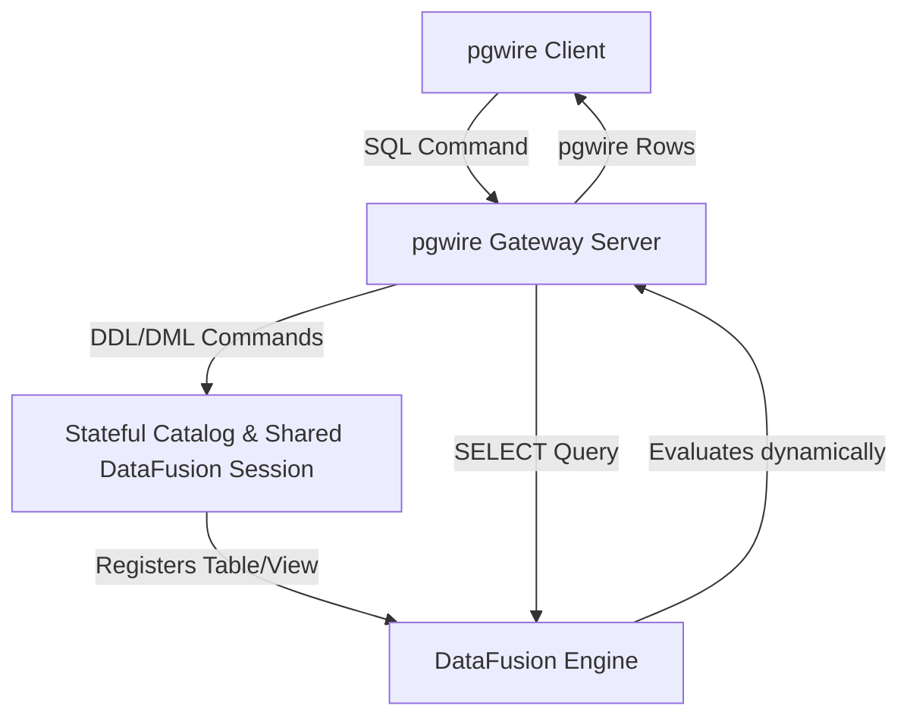

# E2E Test Suite Improvement Plan v3: Complete Lifecycle & Protocol Verification

This plan defines the concrete improvements for the `rockstream-e2e` test suite to achieve thorough correctness validation of all RockStream language features over the PostgreSQL wire protocol (pgwire) as defined in `docs/language-features.md`. It specifically removes the dependency on mock query interception in the gateway server and establishes full-lifecycle tests for `CREATE TABLE`, `CREATE VIEW`, and `CREATE MATERIALIZED VIEW`.

---

## 1. Architectural Improvements: Stateful Gateway

### Current Limitations (Gap Analysis)
1. **Mock Interception**: The `pgwire.rs` query handler intercepts specific SQL strings (e.g. queries containing `"MV_PURCHASES_ENRICHED"`) and returns hardcoded mock columns and data.
2. **Transient Evaluation**: The DataFusion execution context (`SessionContext`) is created locally per-query in `execute_standard_select`. Tables, schemas, and views created in one connection/query do not persist to the next.
3. **No True DDL Execution**: Running `CREATE TABLE` or `CREATE MATERIALIZED VIEW` returns a generic command complete notice but does not create a corresponding schema or queryable table in the execution engine.

### Proposed Architecture
We will refactor the mock gateway to maintain a shared, persistent `SessionContext` and catalog provider inside the gateway server (`Arc<Mutex<GatewayState>>`):



- **Shared State**: Maintain a single `SessionContext` that persists for the lifetime of the gateway.
- **Dynamic DDL Registration**:
  - `CREATE TABLE` parses column types, registers a mutable memory table (`MemTable`) in the DataFusion context, and logs the metadata in `InlineViewCatalog`.
  - `CREATE VIEW` stores the macro-expansion logic in `InlineViewCatalog`.
  - `CREATE MATERIALIZED VIEW` registers a query execution plan, schedules background refreshes (if `BACKGROUND_DDL` is enabled), and tracks dependencies.
- **Mock Deprecation**: Remove hardcoded string checks (e.g. `sql_upper.contains(...)`) from `pgwire.rs`, allowing DataFusion to parse and run the actual SELECT queries dynamically against registered tables.

---

## 2. Complete DDL Lifecycle Specifications

### 2.1 CREATE TABLE Lifecycle
To test table creation and modifications over pgwire:
1. **Creation**: Run `CREATE TABLE my_table (id INT PRIMARY KEY, val VARCHAR, counter COUNTER, max_reg MAX_REGISTER)` over pgwire.
2. **Catalog Introspection**:
   - Query `information_schema.columns` to verify that `my_table` columns exist, have correct names, ordinals, nullability, and mapped OIDs.
   - Verify that standard types map to Postgres OIDs (e.g., `INT` to 23, `VARCHAR` to 1043) and CRDT types are properly registered in the catalog metadata.
3. **Mutations & DML**:
   - Execute `INSERT INTO my_table (id, val, counter, max_reg) VALUES (1, 'apple', 10, 'reg1')`.
   - Execute `INSERT ... RETURNING id, val` to verify returned OIDs and column formats.
   - Run `UPDATE my_table SET val = 'banana', counter = counter + 5 WHERE id = 1`.
   - Run `DELETE FROM my_table WHERE id = 1`.
4. **State Cleanup**: Run `DROP TABLE my_table` and assert that subsequent SELECTs return a relations-not-found error (`RS-2001`).

### 2.2 CREATE VIEW Lifecycle
To test inline view macro expansion and dependency constraints:
1. **View Definition**:
   - Run `CREATE VIEW active_users AS SELECT id, name FROM users WHERE active = true`.
2. **View-on-View Nesting**:
   - Run `CREATE VIEW local_active_users AS SELECT * FROM active_users WHERE region = 'us-east'`.
3. **Macro Expansion Assertions**:
   - Query `SELECT * FROM local_active_users`.
   - Assert that the query engine expands `local_active_users` into the nested subquery `SELECT * FROM (SELECT id, name FROM (SELECT id, name FROM users WHERE active = true) AS active_users) AS local_active_users` at compile/plan time.
4. **Dependency Violations (RS-2004)**:
   - Run `DROP VIEW active_users` and assert that the gateway rejects the drop with error code `RS-2004` (View has dependents).
5. **View Replacement**:
   - Run `CREATE REPLACEMENT VIEW active_users AS SELECT id, name, last_login FROM users WHERE active = true`.
   - Run `ALTER VIEW active_users APPLY REPLACEMENT`.
   - Select from `local_active_users` and verify it can now access the updated schema.
6. **Deletion**:
   - Drop the dependent view: `DROP VIEW local_active_users`.
   - Drop the base view: `DROP VIEW active_users`. Verify both are removed from `information_schema.tables`.

### 2.3 CREATE MATERIALIZED VIEW Lifecycle
To test background backfills, scheduling, pausing, and incremental updates:
1. **Materialized View Definition**:
   - Configure background execution: `SET BACKGROUND_DDL = ON`.
   - Create view with workload parameters:
     ```sql
     CREATE MATERIALIZED VIEW mv_campaign_performance 
     WITH (WORKLOAD = 'realtime', PRIORITY = 'high') 
     AS SELECT campaign_id, COUNT(click_id) AS clicks FROM clicks GROUP BY campaign_id;
     ```
2. **Coordination & Readiness Polling**:
   - Execute `WAIT FOR MATERIALIZED VIEW mv_campaign_performance TO BE READY TIMEOUT 5000`.
3. **Backfill & Workload Introspection**:
   - Query `SHOW VIEW STATUS FOR NAMESPACE public` and verify status is `RUNNING`.
   - Query `SHOW BACKFILL STATUS FOR MATERIALIZED VIEW mv_campaign_performance` and verify progress transitions from `0.0` to `1.0` and status is `COMPLETED`.
   - Query `rockstream_catalog.view_resource_usage` to verify `freshness_lag_ms`, `state_bytes`, and `memory_bytes`.
4. **Incremental View Maintenance (IVM)**:
   - Insert new rows into the base table `clicks`.
   - Query `mv_campaign_performance` and verify the click count increments dynamically without recomputing the entire dataset.
5. **Lifecycle Controls**:
   - Run `PAUSE MATERIALIZED VIEW mv_campaign_performance`. Insert more clicks. Verify the view result is stale/paused.
   - Run `RESUME MATERIALIZED VIEW mv_campaign_performance`. Verify that the view catches up and the result updates.
6. **Zero-Downtime Atomic Replacement**:
   - Define replacement: `CREATE REPLACEMENT MATERIALIZED VIEW mv_campaign_performance AS SELECT campaign_id, COUNT(click_id) AS clicks, SUM(revenue) AS total_revenue FROM clicks GROUP BY campaign_id`.
   - Introspect: `SHOW REPLACEMENT STATUS FOR MATERIALIZED VIEW mv_campaign_performance` (verify status is `PENDING`).
   - Swap views: `ALTER MATERIALIZED VIEW mv_campaign_performance APPLY REPLACEMENT`.
   - Query the view and verify it now surfaces `total_revenue` columns dynamically without subscriber disconnection.
7. **Indexing**:
   - Run `CREATE INDEX idx_campaign ON mv_campaign_performance(campaign_id) WHERE clicks > 100`.
   - Execute `EXPLAIN INDEX SELECT * FROM mv_campaign_performance WHERE campaign_id = 10` and verify the planner selects the index scan.
   - Run `REBUILD INDEX idx_campaign`.
   - Run `DROP INDEX idx_campaign`.
8. **Deletion**:
   - Run `DROP MATERIALIZED VIEW mv_campaign_performance`. Verify resources are freed in the catalog.

---

## 3. Language Features E2E Verification over PGWIRE

All language features from `docs/language-features.md` must be dynamically verified using the stateful gateway.

### 3.1 Scalar & Mathematical Expressions
Execute SELECT queries that compute:
- **Casts**: `CAST(price AS DOUBLE)` and error-safe type coercion `TRY_CAST(amount AS DOUBLE)`.
- **Conditionals**: `CASE WHEN price > 100 THEN 'expensive' ELSE 'cheap' END`.
- **Date/Time**: `NOW()` returning stable database timestamps, and interval math: `ts + INTERVAL '1 hour'`.

### 3.2 Relational Operators & Joins
Create base tables (`orders`, `users`, `products`) and populate them. Run queries containing:
- **Join Variations**: `INNER JOIN`, `LEFT JOIN`, `RIGHT JOIN`, `FULL OUTER JOIN`, `CROSS JOIN`, `SEMI JOIN`, and `ANTI JOIN` (asserting exact schemas, nullability, and values).
- **Set Operations**: `UNION`, `UNION ALL`, `INTERSECT`, and `EXCEPT` (asserting correct set/bag semantics and rows).
- **LATERAL Subqueries**: Join tables with parameterized subqueries using `LATERAL`.

### 3.3 Analytics & Time Windows
- **Window Functions**: `ROW_NUMBER()`, `RANK()`, `DENSE_RANK()`, `LAG()`, `LEAD()`, and `NTILE()` over partition clauses (`PARTITION BY ... ORDER BY ...`).
- **Time Windows**: `TUMBLE(ts, INTERVAL '1 minute')` queries grouped by tumble intervals.
- **Watermarks**: Late-data policies (`drop`, `update`, `route_to_sink`) and watermark gating checks.

### 3.4 CRDT Aggregations
Verify algebraic aggregation maintenance:
- Execute `SUM`, `COUNT`, `AVG`/`MEAN`, `MIN`, `MAX` over base tables.
- Verify that DataFusion applies correct merge laws (`WeightAdd/v1`, `SumCount/v1`, `MaxRegister/v1`, `MinRegister/v1`) under group aggregation.
- Assert that `EXPLAIN INCREMENTAL` exposes the active merge law and compaction metrics.

### 3.5 Recursion
Verify monotone graph traversal queries:
- Execute `WITH RECURSIVE monotone_nodes AS (...)` queries.
- Verify DRed rejection (rejection of non-monotone terms) throws correct compiler error.

### 3.6 Historical & Streaming Reads
- **AS OF**: Verify historical query variants `AS OF EPOCH <val>`, `AS OF TIMESTAMP <val>`, `AS OF NOW WITH SNAPSHOT`.
- **SUBSCRIBE**: Verify streaming subscriptions using the `SUBSCRIBE <relation>` syntax, checking for `mz_timestamp` and `mz_diff` column updates.

### 3.7 Session & Freshness Controls
- Run `SET rockstream.session_wait_for = off`.
- Run `SET rockstream.max_staleness = 5000`.
- Verify write fence tokens using `rockstream.write_fence()` and `rockstream.after_fence(...)`.

### 3.8 Transactions & Isolation Checks
Verify transaction boundaries and isolation:
- Run `SET TRANSACTION ISOLATION LEVEL READ COMMITTED` and `REPEATABLE READ` (verify success).
- Run `SET TRANSACTION ISOLATION LEVEL SERIALIZABLE` and verify it fails with code `RS-2003`.
- Optimistic write conflicts: Simulate concurrent writes and assert code `RS-2008` (optimistic conflict).
- Client Idempotency Keys: Execute writes without idempotency tokens and verify failure with code `RS-2007`.

### 3.9 Dead-Letter Queue (DLQ) Operations
- Trigger decode errors and verify ingestion routing to `rockstream_catalog.dead_letter_queue`.
- Replay: Run `ALTER SOURCE src REPLAY DEAD_LETTER_QUEUE SINCE ... UNTIL ...` and verify replay attempts increment in the catalog.
- Dismissal: Run `ALTER SOURCE src DISMISS DEAD_LETTER_QUEUE WHERE error_code = 'RS-1003'` and verify corresponding errors are cleared.

---

## 4. Verification Plan

### Automated Regression Suite
We will implement these test blocks inside a new file `crates/rockstream-e2e/tests/ddl_lifecycle_tests.rs`:
- `test_table_lifecycle_and_crdt_merging()`: Verifies table creation, mutation, and columns introspection.
- `test_view_lifecycle_and_dependencies()`: Verifies view registration, nesting, and RS-2004 dependency enforcement.
- `test_mview_lifecycle_ivm_and_replacement()`: Verifies materialized view updates, pausing/resuming, and atomic replacement.
- `test_pgwire_language_features_coverage()`: Verifies all scalar, relational, analytical, transaction, and diagnostic commands.
